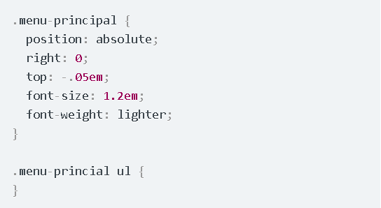
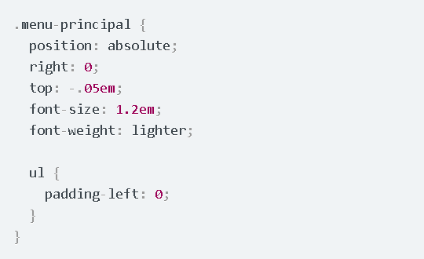
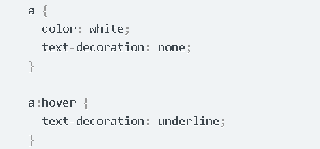
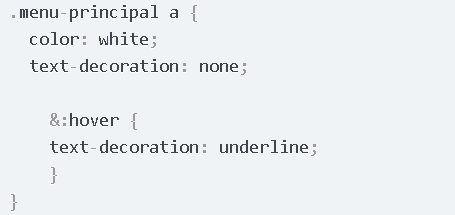
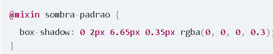
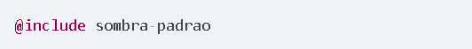
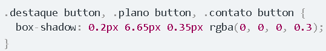
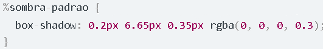
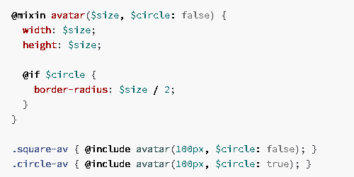
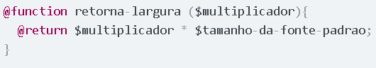

<h1>Sass EJECT</h1>
<h2>Objetivos</h2>

O objetivo do documento é apresentar o Sass, passando por suas funções básicas e mostrando possíveis lugares em que os membros podem conseguir complementar seus estudos e conhecimentos.

<h2>Por que usar o Sass?</h2>
<ul>
    <li>Simplificar e organizar melhor o código;</li>
    <li>Melhorar e facilitar a manutenção;</li>
    <li>Ajuda na compatibilidade com múltiplos navegadores;</li>
    <li>Possibilidade de programar com CSS: Variáveis, funções, condições e repetições;</li>
</ul>
<h2>O que é o Sass?</h2>

Como dito no próprio site do Sass, é um CSS com super poderes. Ele é um pré-processador, ou seja, tudo que escrevermos no código sass(um arquivo .scss) vai ser compilado e "traduzido" para um CSS (o arquivo que já conhecemos pela extensão .css) que pode ser compreendido pelo navegador. A diferença está exatamente nos super poderes que o sass proporciona pra gente permitindo criar condições com if else, repetições com for, e evitar repetição de código com seus mixins.

<h2>Instalação</h2>

Existem algumas formas de instalar e usar o sass na sua máquina, nesse tópico eu vou apresentar apenas uma, mas todas as outras podem ser encontradas nas referências que eu vou deixar abaixo

<h4>Windows</h4>
<ol>
    <li>O primeiro passo é instalar o ruby na sua máquina, pode fazer isso nesse link: <a href="http://rubyinstaller.org/downloads">http://rubyinstaller.org/downloads</a></li>
    <li>Durante a instalação marque a opção "Add Ruby executables to your PATH" e prossiga a instalação:</li>
    <li>Depois de finalizar  você pode verificar se deu tudo certo digitando o comando "ruby -v" no seu terminal</li>
    <li>Para instalar o Sass rode o comando "gem install sass" no seu terminal</li>
</ol>
<h4>Linux</h4>

Você pode instalar o ruby na seu linux com o comando "sudo apt-get install ruby"

<ol>
    <li>Você pode instalar o ruby na seu linux com o comando "sudo apt-get install ruby"</li>
    <li>Para instalar o Sass rode o comando "sudo gem install sass" no seu terminal</li>
</ol>
<h2>Funcionalidades do Sass</h2>

Estrutura

     
    
    
 A estrutura consiste em na organização de arquivos e pastas. É comum que em algum momento da nossa aplicação tenhamos um código CSS enorme, mesmo que aja um esforço constante em evitar isso. Por isso no sass é considerado uma boa pratica separar os arquivos em componentes para facilitar tanto a escrita do código durante o desenvolvimento quanto em manutenções posteriores. Ao final você vai notar que mesmo com vários arquivos .scss a sua aplicação estará rodando apenas um arquivo CSS.
     
    Podemos ver uma pasta CSS, nela criamos uma pasta chamada components que irá conter cada componente da aplicação. O arquivo main ficará dentro da pasta CSS, ele será o responsável por receber os componentes e juntar em um único arquivo. Ao fim vocês vão entender como isso vai acontecer. Lembrando que não é uma convenção, você pode usar a estrutura que lhe agradar.
   

    

Partials ou Componentes

     
    
Os componentes, também conhecidos como partials serão arquivos que não vão ser compilados. Por exemplo, nas nossas aplicações geralmente temos navbar, seção quem somos, parceiros e o footer. Criaríamos um arquivo para cada utilizando a extensão scss (_navbar.scss, _quemSomos.scss, _parceiro.scss e _footer.scss), mas eles não seriam compilados em arquivos css individuais. Esses arquivos serão importados dentro do nosso arquivo principal (main.scss ou style.scss)

@Import

     
    
Como dito no último tópico nó importaremos todos os arquivos para dentro do nosso arquivo principal, e para fazer isso usamos o @import

    <blockquote>
    @import "_navbar"; 
    @import "_quemSomos"; 
    @import "_parceiros"; 
    @import "_footer";
    </blockquote>
    
Assim nosso arquivo principal (main.scss ou style.scss) teria a única responsabilidade de juntar todos os arquivos e compilar em um único CSS também.

Variáveis

     
    
Variáveis O uso de variáveis já é possível no CSS moderno, mas também é algo importante de freezar sobre o sass. Essa é uma funcionalidade muito valiosa.

    <code>$nome_da_variavel : Conteúdo</code>
    
Podemos por exemplo definir cores, conteúdo de texto e números em variável. Assim, sempre que quisermos usar aquele conteúdo basta chamar a variável.
     
    A utilidade disso está na manutenção, pois caso queira modificar o seu valor, só precisa modificar na variável que ele será modificado em todos os lugares que foi usado.

Encadeamento/Aninhamento

     
    
É comum durante o desenvolvimento nos depararmos com estruturas parecidas com essa:

    
    
E apesar de comum a estrutura tem uma escrita trabalhosa e pouco produtiva, levando ao uso repetitivo do Ctrl+C Ctrl+v. Para resolver isso o sass vem com uma funcionalidade de estrutura de aninhamento, veja o exemplo acima escrito em Sass:

    
    
A segunda estrutura depois de compilada será igual a primeira, a diferença é que na hora de escrever ela, você não precisou repetir nada.

Referecing

     
    
Vimos acima uma forma fácil e de aninhar estruturas. O referecing veio pra referenciar elementos dentro dessa estrutura. A estrutura abaixo mostra o hover no CSS, no qual é necessária uma nova estrutura.

    
    
No sass podemos usar o prefixo &, para referenciar um elemento que veio antes dele.

    

Mixins

     
    
Os mixins são estruturas que basicamente servem pra guardar um trecho de código para que ele seja utilizado em outras partes sem a necessidade de escrever ele sempre. Um bom exemplo de código que sempre repetimos é o box-shadow, abaixo a estrutura de um mixin do box-shadow

    
    
Para incluir ele em qualquer ponto do seu código, basta usar a sintaxe abaixo no lugar que quiser

    

Extends e Placeholder

     
    
Os placeholders surgem com mais uma alternativa para evitar repetição de código. Ele ajuda a criar aquela estrutura de virgulas que já conhecemos do CSS:

    
    
Apesar dessa estrutura ser considerada uma boa pratica, ela sempre tem que ser feita na mão. O placeholder e o Extend do sass vem pra automatizar a criação delas. Veja abaixo a criação de um placeholder para box-shadow(de  novo).

    
    
Para utilizar ele basta usar o Extend nos elemento que deseja acrescentar o placeholder

    
    
Usar isso irá fazer uma estrutura como a da primeira imagem, e caso queira alterar algo basta alterar no código do placeholder

Condicionais

     
    
As condicionais em Sass funciona de forma similar às linguagens de programação mais comuns. Aquele velho if else segue a mesma lógica. Sempre passamos uma condição, se ela for verdadeira o bloco de código daquela estrutura será executado. Caso seja falsa temos a opção de utilizar o else para passar outro resultado.

    
    
No exemplo acima vemos que inicialmente (linha 1) a variável "$circle" tem seu valor inicial como false. o If vai verificar se aquela variável tem valor verdadeiro. caso tenha será executado o código do border-radius.
     
    Perceba que na última linha, ao incluir o mixin o valor da variável circle (naquele escopo) como true, assim o código do border-radius será executado por ele. 
    

Funções

     
    
Funções são blocos de código que executam determinada função, como é dito em todas as linguagens de programação. No sass não é diferente, podemos criar um certo bloco de código para executar determinada função, e chama-lo quando for necessário. Uma função sempre vai retornar alguma coisa, diferente dos mixins que entrega um trecho de código. Veja o exemplo abaixo:

    

<h2>Referências</h2>

