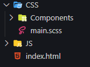

<h1>Sass EJECT</h1>
<h2>Objetivos</h2>
<p>O objetivo do documento é apresentar o Sass, passando por suas funções básicas e mostrando possiveis lugares em que os membros podem conseguir complementar seus estudos e conhecimentos.</p>
<h2>Por que usar o Sass?</h2>
<ul>
    <li>Simplificar e organizar melhor o código;</li>
    <li>Melhorar e facilitar a manutenção;</li>
    <li>Ajuda na compatibilidade com multiplos navegadore;</li>
    <li>Possibilidade de "programar com CSS: Variaveis, funções, condiçoes e repetiçoes;</li>
</ul>
<h2>O que é o Sass?</h2>
<p>Como dito no proprio site do Sass, é um Css com super poderes. Ele é um pré-processador, ou seja, tudo que escrevermos no código sass(um arquivo .scss) vai ser compilado e "traduzido" para um CSS (o arquivo que ja conhecemos pela extensão .css) que pode ser compreendido pelo navegador. A diferença esta esatamente nos super poders que o sass proporciona pra gente permitindo criar condiçoes com if else, repetiçoes com for, e evitar repetição de código com seus mixins.</p>
<h2>Instalação</h2>
<p>Existem algumas formas de instalar e usas o sass na sua máquina, nesse tópico eu vou apresentar apenas uma, mas todas as outras podem ser encontradas nas referencias que eu vou deixar abaixo</p>
<h4>Windows</h4>
<ol>
    <li>O primeiro passo é instalar o ruby na sua maquina, pode fazer isso nesse link: <a href="http://rubyinstaller.org/downloads">http://rubyinstaller.org/downloads</a></li>
    <li>Durante a instalação marque a opção "Add Ruby executables to your PATH" e prossiga a instalação:</li>
    <li>Depois de finalizar  você pode verificar se deu tudo certo digitando o comando "ruby -v" no seu terminal</li>
    <li>Para instalar o Sass rode o comando "gem install sass" no seu terminal</li>
</ol>
<h4>Linux</h4>
<p>Você pode instalar o ruby na seu linux com o comando "sudo apt-get install ruby"</p>
<ol>
    <li>Você pode instalar o ruby na seu linux com o comando "sudo apt-get install ruby"</li>
    <li>Para instalar o Sass rode o comando "sudo gem install sass" no seu terminal</li>
</ol>
<h2>Funcionalidades do Sass</h2>


<details>
<summary>Estrutura</summary>
    <br>
    
    <p> A estrutura conciste em na organização de arquivos e pastas. É comum que em algum momento da nossa aplicação tenhamos um código  CSS enorme, mesmo que aja um esforço constante em evitar isso.Por isso no sass é considerado uma boa pratica separar os arquivos em componentes para facilitar tanto a escrita do código durante o desenvolvimento quanto em manutenções posteriores. Ao final vc vai notar que mesmo com varios arquivos .scss a sua aplicação estará rodando apenas um arquivo CSS.</p>
    <br>
    <p> Podemos ver uma pasta CSS, nela criamos uma pasta chamada components que irá conter cada componente da aplicação. O arquivo main ficará dentro da pasta CSS, ele será o responsavel por receber os componentes e juntar em um unico arquivo. Ao fim vocës vão entender como isso vai acontecer. Lembrando que não é uma convenção, vc pode usar a estrutura que lhe agradar.</p>    
</details>
    
<details>
<summary>Partials ou Componentes</summary>
    <br>
    <p>Os componentes, também conhecidos como partials serão arquivos que não vão ser compilados. Por exemplo, nas nossas aplicações geralmente temos navbar, seção quem somos, parceiros e o footer. Criariamos um arquivo para cada ultilizando a extenção scss (_navbar.scss, _quemSomos.scss, _parceiro.scss e _footer.scss), mas eles não seriam compilados em arquivos css individuais. Esses aquivos serão importados dentro do nosso arquivo principal (main.scss ou style.scss)</p>
</details>

<details>
<summary>@Import</summary>
    <br>
    <p>Como dito no último tópico nó importaremos todos os arquivos para dentro do nosso arquivo principal, e para fazer isso usamos o @import</p>
    ` ` `
        @import "_navbar";
        @import "_quemSomos";
        @import "_parceiros";
        @import "_footer";
    ` ` `
</details>

<details>
<summary>Variaveis</summary>
```
```
</details>

<details>
<summary>Encadeamento</summary>
```
```
</details>

<details>
<summary>Mixins</summary>
```
```
</details>

<details>
<summary>Extends e PLaceholder</summary>
```
```
</details>

<details>
<summary>Condicionais</summary>
```
```
</details>

<details>
<summary>Repetições</summary>
```
```
</details>

<details>
<summary>Referecing</summary>
```
```
</details>

<details>
<summary>Funções</summary>
```
```
</details>
